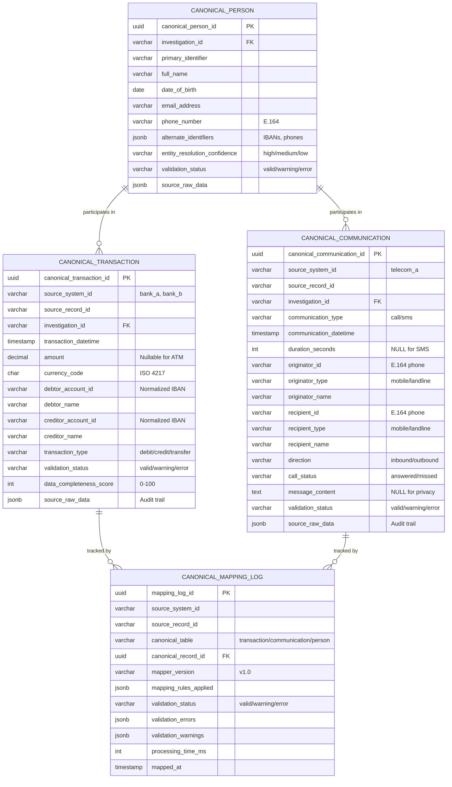
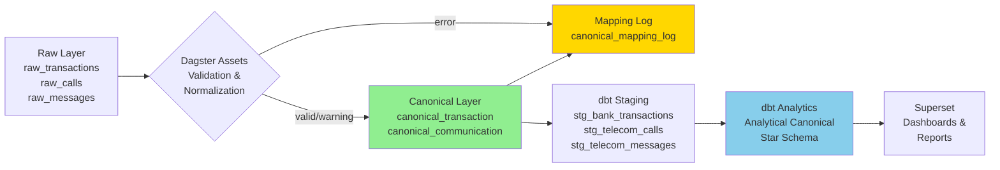
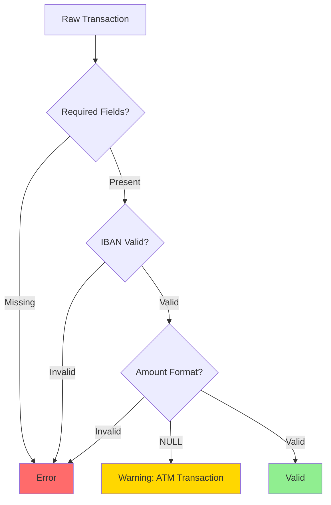
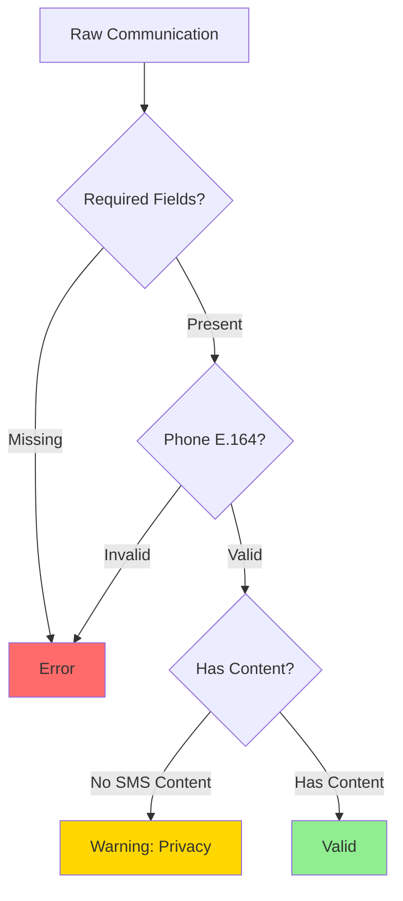
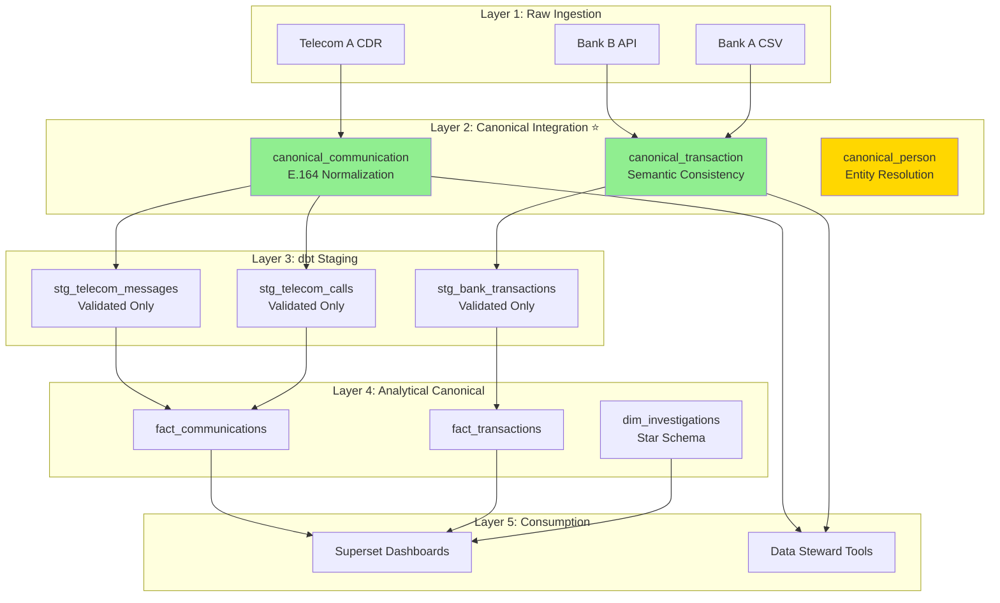

# Canonical Data Model - Entity Relationship Diagram

## 📊 Schema Overview

## 🔄 Data Flow

## 📈 Current Stats

| Layer | Tables | Records | Status |
|-------|--------|---------|--------|
| **Canonical** | 2 active | 145 | ✅ Production |
| - Transactions | 1 | 69 | 59 valid, 10 warning |
| - Communications | 1 | 76 | 44 valid, 32 warning |
| - Person | 1 | 0 | 🔨 Not implemented |
| **Mapping Log** | 1 | 0 | ⚠️ Temporarily disabled |

## 🔍 Validation Rules

### Transaction Validation

### Communication Validation

## 🏗️ Architecture Layers

## 📝 Schema Evolution

### Version History

| Version | Date | Changes |
|---------|------|---------|
| 1.0 | 2025-10-15 | Initial canonical schema with transaction & communication |
| 1.1 | 2025-10-15 | Changed `amount` from NOT NULL to nullable for ATM support |

### Planned Enhancements

- [ ] `canonical_person` implementation (entity resolution)
- [ ] `canonical_mapping_log` re-enable
- [ ] Additional source systems (Bank B, Telecom B)
- [ ] Temporal tracking (SCD Type 2)
- [ ] Data lineage visualization

---

**📚 See Also**:
- [Data Steward Guide](CANONICAL_DATA_STEWARD_GUIDE.md)
- [Implementation Status](CANONICAL_IMPLEMENTATION_STATUS.md)
- [Data Quality Report](CANONICAL_DATA_QUALITY_REPORT.md)
